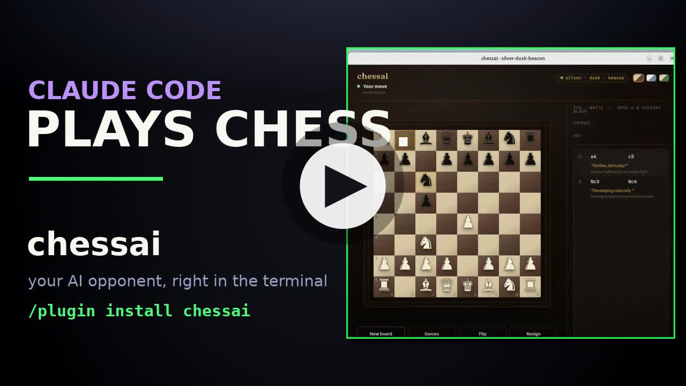

<div align="center">

# ♛&nbsp; chessai

### Play chess against Claude Code.

You move **white** on a tactile browser board.<br>
A background Claude agent plays **black** — replying to every move with a comment and its reasoning.

<br>

[](#license)
[](https://docs.claude.com/en/docs/claude-code)
[](.claude-plugin/plugin.json)
[](#requirements)
[](#the-board)
[](#light-on-your-plan)

<br>

<a href="https://youtu.be/TSvWvIIjBXg">
  
</a>

<sub>▶ &nbsp;<b><a href="https://youtu.be/TSvWvIIjBXg">Watch the 60-second demo</a></b> — install, launch, and a full game</sub>

<br>
<br>

**Install in two lines** — inside Claude Code:

</div>

```text
/plugin marketplace add devasur/chessai
/plugin install chessai@chessai
```

<div align="center">

…then run <kbd>/chessai:chess</kbd> and make your move.

</div>

<div align="center">

♟&nbsp;&nbsp;♞&nbsp;&nbsp;♝&nbsp;&nbsp;♜&nbsp;&nbsp;♛&nbsp;&nbsp;♚

</div>

## Why this exists

Most "LLM plays a game" projects are one giant prompt that bloats with every move and bills you per turn. chessai goes the other way: **the only thing that needs a model is choosing a move.** Everything else — rules, legality, board state, the UI — is plain, deterministic Node and browser JS.

The opponent is a Claude **subagent**, so on a Claude Code subscription your inference is already covered: **no API key, no metered per-move billing.** And because nothing about the *game* is Claude-specific, the brain is ~one function you can swap for any harness (see [Fork it](#fork-it-to-any-harness)).

## Quick start

> **Requires [Node.js](https://nodejs.org) on your `PATH`.** The plugin only bundles files — no build step, no other runtime.

**1 · Add the marketplace and install** (inside Claude Code):

```text
/plugin marketplace add devasur/chessai
/plugin install chessai@chessai
```

This registers the skill <kbd>/chessai:chess</kbd> and the agent **`chessai:chess-ai`**.

**2 · Play:**

```text
/chessai:chess
```

The skill starts the Node server, opens the board in a chromeless app-style window (Chromium-family browsers; falls back to your default), and spawns the AI opponent. Click a piece, then its destination — black replies within a couple of seconds, with commentary in the move-list panel.

- **New board** → another game in its own window for side-by-side play.
- **Games** → list every board; switch, pop out, or delete.
- **Skin swatches** → switch theme (saved per game).
- Window geometry: `CHESSAI_WIN_SIZE="W,H"`, `CHESSAI_WIN_POS="X,Y"`.

<details>
<summary><b>Run the board without Claude</b> — or for local development</summary>

<br>

From a clone of this repo, launch just the server + UI (you'll be playing both sides, or wire up your own driver):

```sh
node skills/chess/tools/server.cjs --port 4577 --open
```

For local plugin development, skip the marketplace entirely:

```sh
claude --plugin-dir /path/to/chessai
```

</details>

## The board

A dark **"Midnight Study"** theme (plus **Ivory** and **Emerald** skins) — inlaid board, brass accents, grain + vignette, and a full **legal-move engine in the browser**. You can only make legal moves, with reachable squares highlighted: dots for quiet moves, rings for captures. Castling, en passant, promotion, check, checkmate and stalemate are all handled, and the client declares the result.

<table>
<tr>
<td width="50%"></td>
<td width="50%"></td>
</tr>
<tr>
<td align="center"><sub><b>Midnight Study</b> — inlaid board, brass, grain + vignette</sub></td>
<td align="center"><sub><b>Legal-move hints</b> — dots for moves, rings for captures</sub></td>
</tr>
</table>

The engine is validated with **perft** against standard positions — startpos, Kiwipete, en-passant and promotion positions all match known node counts — so move generation, including pins and through-check castling, is provably correct.

## How it works

Three clean layers, one rule: **the only thing that needs an LLM is choosing a move.**

```text
 you (white)            node server.cjs                 chess-ai agent
 browser board  ◀─HTTP─▶ multi-game state + FEN  ◀─HTTP─▶ (Claude subagent, Bash-only:
 (legal-move engine)     REST + web UI; no brain          poll /pending?all=1 → pick
                                                          moves → POST; batched,
                                                          backs off, self-stops)
```

| Layer | File | Role |
|---|---|---|
| **Plugin** | `.claude-plugin/plugin.json` | *Packaging only.* Bundles the skill, tools, and agent so Claude Code discovers them on install. No game logic. |
| **Server** | `skills/chess/tools/server.cjs` | Authoritative state for every game (FEN, castling, en passant, promotion, persistence) + REST API + web UI. **No chess intelligence — pure plumbing.** |
| **Browser** | `skills/chess/tools/web/*`, `board.html` | The clickable UI *and* the human's legal-move engine; detects and posts the result. |
| **Agent** | `agents/chess-ai.md` | **The brain.** Restricted to `Bash`, holds no game state. Polls for boards needing black, picks moves, POSTs them. |

The web layer is modular ES modules: `engine.js` (pure rules), `api.js` (REST client), `view.js` (DOM), `app.js` (controller), `theme.css` + `board.css`.

## Light on your plan

The AI opponent is the **only** part that spends tokens — and it's built to stay light. It carries only the `Bash` tool and keeps no game history, so each move is a small, roughly fixed cost (~5–6k tokens of context) instead of a transcript that grows all game.

| Activity | Token cost |
|---|---|
| **Engine start** | ~5–6k tokens once, when the agent first loads — then cached |
| **Per move, one board** | a few thousand new tokens; most context is cached and re-read cheaply |
| **Per move, many boards** | shared — one wake plays every pending board at once |
| **Idle / walked away** | ≈ nothing (polling is plain `curl`), then it **stops itself after ~24 min** |

The model only runs when there's actually a move to make — waiting for *your* move is a token-free `curl` long-poll — so a game left sitting costs almost nothing, and a forgotten one shuts itself off rather than draining tokens in the background.

<sub>Numbers are from recent games on Sonnet; actual cost scales with the model set in <code>agents/chess-ai.md</code> frontmatter.</sub>

## Fork it to any harness

Nothing about the *game* is Claude-specific — the server and browser are plain Node/JS with **zero Claude dependency**. The brain is ~one function against a three-call contract:

```text
1. GET  /api/pending?all=1&wait=1   → [{ id, fen, move_count }, …]   blocks until boards need black
2. choose a move per board from its FEN
3. POST /api/games/<id>/move         { from, to, san, by:"ai", expected_ply:move_count, … }
```

To fork to **any** harness — a Python script, a cron job, a different model, the Anthropic API directly — replace `agents/chess-ai.md` with your own loop implementing those three calls. Nothing else changes:

- `&wait=1` **long-polls**, so your loop blocks on one call instead of busy-waiting.
- `?all=1` returns **every** pending board, and `expected_ply` is a compare-and-swap guard — so your driver can be **stateless** and never track games itself.
- One server backs every session; `/api/health` reports `chessai_agent_active`, so a second launcher reuses the running server instead of starting a duplicate.

<details>
<summary><b>REST API reference</b> — <code>server.cjs</code></summary>

<br>

| Method | Path | Notes |
|--------|------|-------|
| `GET` | `/` | clickable web board |
| `GET` | `/api/health` | `{ ok, service:"chessai", version, games, chessai_agent_active }` |
| `GET` | `/api/games` | list every game (id, name, fen, turn, status, theme, opponent, last move…) |
| `POST` | `/api/games` | create a game (server assigns the three-word id) |
| `GET` | `/api/pending?all=1` | **array** of every board needing black — the agent's source |
| `GET` | `/api/pending?all=1&wait=1` | same, but **long-polls**: holds open until a board needs black (coalescing near-simultaneous moves into one batch), or ~8 min → `[]` |
| `GET` | `/api/games/<id>` | full state incl. history |
| `POST` | `/api/games/<id>/move` | `{ from, to, san?, promotion?, by?, expected_ply?, harness?, model?, comment?, reasoning? }` |
| `POST` | `/api/games/<id>/reset` | reset to the starting position |
| `POST` | `/api/games/<id>/status` | `{ status }` — end the game |
| `POST` | `/api/games/<id>/theme` | `{ theme }` — `midnight \| marble \| emerald` |
| `POST` | `/api/games/<id>/opponent` | `{ harness?, model?, name? }` — who plays black |
| `DELETE` | `/api/games/<id>` | delete the game and its saved file |

CLI wrapper (from a clone): `node skills/chess/tools/chess-api.cjs games 4577`

</details>

<details>
<summary><b>Stopping &amp; lifecycle</b></summary>

<br>

- **Stop the whole session** — in Claude Code, stop the **server** background task and the **`chess-ai`** agent task (both started with `run_in_background`). Close the board window normally.
- **Pause only the AI** — stop just the `chess-ai` agent task; the server and boards stay up. Relaunch the agent to resume.
- **The agent stops itself** after ~24 min idle. To resume, make a move and ask Claude to relaunch the opponent.
- **Free the port** — if `server.cjs` says the port is in use, the previous server is still running; stop that task (or `pkill -f server.cjs`).

Games survive all of this: they persist to `~/.chessai/games/<id>.json` (override with `CHESSAI_DATA_DIR`) and reload when the server restarts.

</details>

<details>
<summary><b>Design notes</b></summary>

<br>

- **Where the rules live:** the *server* board model is intentionally permissive (applies any well-formed move) — keeping it dumb. Legality is enforced by the *browser* engine for the human, while the agent chooses its own legal moves for black. The client detects and posts the result (checkmate, stalemate, fifty-move).
- **Statelessness by design:** the `expected_ply` compare-and-swap guard lets the agent (or any forked driver) submit a move without tracking games — the server rejects a move computed against a stale position, so one driver can serve every parallel board safely.
- **Upgrades:** `/plugin update chessai` pulls the latest skill and agent. The `version` in `.claude-plugin/plugin.json` drives update detection (bump per release); refresh the catalog first with `/plugin marketplace update chessai`.

</details>

## Requirements

- **[Node.js](https://nodejs.org)** on your `PATH` (the server and tools are Node — no npm install, no build step).
- **[Claude Code](https://docs.claude.com/en/docs/claude-code)** to install the plugin and host the AI opponent. *(For the board alone, Node is enough.)*
- A Chromium-family browser for the chromeless app window — otherwise it opens in your default browser.

## License

**MIT** © [devasur](https://github.com/devasur)

<div align="center">
<br>
<sub>Built with Claude Code · the opponent is a Claude subagent · <a href="https://youtu.be/TSvWvIIjBXg">watch the demo</a></sub>
<br><br>

♚

</div>
