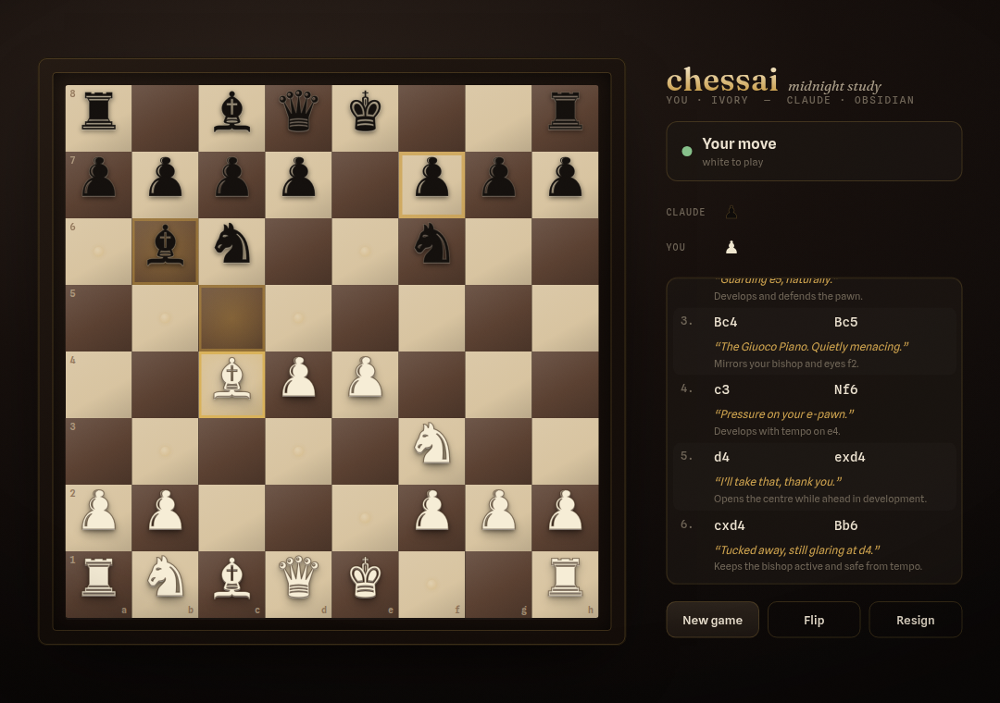

# chessai

Play chess against Claude Code. You play white on a clickable browser board; a
background Claude agent plays black, replying to each move with a comment and its
reasoning.


```
 you (white) ──HTTP──▶  node server.cjs  ◀──HTTP──  black-player Agent
                        (state + FEN +              (Claude, spawned by the
   browser board          REST + web UI;             /chess skill: poll → decide
   (click to move)        no intelligence)           → POST, looping)
```

## The board

A dark **"Midnight Study"** theme — walnut-and-parchment inlaid board, brass
accents, grain + vignette, and a full **legal-move engine in the browser**: you
can only make legal moves, with the reachable squares highlighted (brass dots for
quiet moves, rings for captures). Castling, en passant, promotion, check,
checkmate and stalemate are all handled, and the client declares the result.



The engine is validated with **perft** against standard positions (startpos,
Kiwipete, en-passant and promotion positions all match known node counts), so
move generation — including pins and through-check castling — is correct.

## Architecture

Two pieces, clean split of responsibility:

- **`chessai` (Rust binary)** — *install only*. It embeds the skill files and
  writes them to `~/.claude/skills/chess`. It's purely a **distribution vehicle**
  so you can install the skill without the plugin marketplace. It contains no
  game logic.
- **The `chess` skill (Node)** — the whole game:
  - `tools/server.cjs` — dependency-free Node HTTP server: authoritative board
    state, FEN, REST API, serves the web UI, and opens the board as a chromeless
    app window. **No chess intelligence — pure plumbing.**
  - `tools/board.html` — the clickable board + the legal-move engine (the human's
    rules authority).
  - `SKILL.md` — orchestration: start the server, open the board, and spawn **one
    background Claude agent** that plays black. That agent is the only place moves
    are chosen; its context persists and prompt-caches across moves, so there's no
    per-move cold-start cost.

> Requires **Node.js** on PATH (the server and tools are Node). The Rust binary
> only writes files.

## Install

Any one of (each puts `chessai` on PATH, then runs `chessai install`):

```sh
# npm — builds the tiny Rust installer on first run
npx @entelligentsia/chessai install

# cargo — builds from the git repo (the crates.io name `chessai` is an unrelated crate)
cargo install --git https://github.com/devasur/chessai chessai && chessai install

# curl | sh
curl -fsSL https://raw.githubusercontent.com/devasur/chessai/main/install.sh | sh
```

`chessai install` writes:

```
~/.claude/skills/chess/
  SKILL.md
  tools/server.cjs
  tools/board.html
  tools/chess-api.cjs
```

## Play

Inside Claude Code:

```
/chess
```

The skill starts the Node server, opens the board in a chromeless app-style
window (Chromium-family browsers; falls back to your default browser), and spawns
the black-player agent. Click a piece then its destination; Claude replies within
a couple of seconds. Commentary and reasoning appear in the move-list panel.

The popup window's size/position can be tuned with `CHESSAI_WIN_SIZE="W,H"` and
`CHESSAI_WIN_POS="X,Y"`.

### Run the board without Claude

```sh
node ~/.claude/skills/chess/tools/server.cjs --port 4577 --open
```

## REST API (`server.cjs`)

| Method | Path          | Notes                                                         |
|--------|---------------|---------------------------------------------------------------|
| GET    | `/`           | clickable web board                                           |
| GET    | `/api/health` | `{ ok, version }`                                             |
| GET    | `/api/state`  | full: `{ fen, turn, status, move_count, last_move, history }`|
| GET    | `/api/turn`   | compact (used by the agent): no growing history              |
| POST   | `/api/move`   | `{ from, to, san?, promotion?, comment?, reasoning?, by? }`  |
| POST   | `/api/reset`  | reset to the starting position                               |
| POST   | `/api/status` | `{ status }` — end the game                                  |

## Notes

- **Where the rules live:** the *server* board model is intentionally permissive
  (it applies any well-formed move) — keeping it dumb. Legality is enforced by the
  *browser* engine for the human, while Claude chooses its own legal moves for
  black. The client also detects and posts the game result (checkmate, stalemate,
  fifty-move).
- **Why the agent polls `/api/turn` not `/api/state`:** `/state` carries the
  entire move history, which grows every turn; `/turn` is a small flat payload, so
  the long-lived agent's context stays cheap.
- **Upgrades:** the npm launcher stamps the built binary with its version and
  rebuilds when it changes, so `npx @entelligentsia/chessai@latest install` always
  lays down the current skill (and clears any legacy workflow file).

## License

MIT
